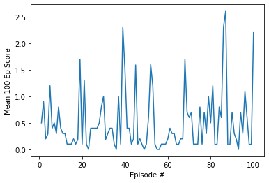

# Collaborative Tennis (Project 3: Collaboration and Competition)

## What are we to do

In this environment, two agents control rackets to bounce a ball over a net. If an agent hits the ball over the net, it receives a reward of +0.1.  If an agent lets a ball hit the ground or hits the ball out of bounds, it receives a reward of -0.01.  Thus, the goal of each agent is to keep the ball in play.

The environment is considered solved, when the average (over 100 episodes) of those **scores** is at least +0.5.

## Multi Agent Reinforcement Learning

This project uses **MADDPG** algorithm to solve the problem. MADDPG is an extension of DDPG, that has been modified for multi agent (both cooperative and competitive settings). MADDPG is an offline actor-critic RL algorithm and the core idea is that each agent has a local isolated view of the environment that it percieves and uses to act in the environment. But for learning, a central critic is used that has information about all of the combined states, actions and rewards acquired by all of the agents in the environment.

Each agent has their own actor and critic networks.

[Original paper](https://arxiv.org/abs/1706.02275)

The following is a plot of last 100 episodes:



The following is a plot of all episodes:


Final weights have been saved to: [Final weights file](final_score.pth)

## Environment

|Parameter|Value|
|-|-|
|Agents|2|
|State Space|24 (per agent)|
|Action Space|Tuple of 2 continous values between -1.0 and 1.0 (One value control horizontal movement and the other vertical)|

# MADDPG Algorithm

[images/algorithm.png](images/algorithm.png)

## Implementation Details

1. Agent class has been defined that represents a local agent
2. MADDPG class crates two of such agents. The training loop communicates with this object.
3. Inital replay buffer is filled by taking random actions
4. Each time step: states (shape=2,24), actions(shape=2,2), rewards (shape=2,1), next_states (shape=2,24), dones(shape=2,1) are saved in the replay buffer
5. Each time step both agents are trained and their weights are updated using the following steps

### Agent Training

1. Draw a sample of batch (size=250) from the replay buffer
2. This sample has two states, two next states, two set of actions and two set of rewards
3. Originally one of the two states was generated by the other agent but for testing we pass both the states to the local / target actor of this agent.
4. Set `next_actions = [target_actor(next_state[0]), target_actor(next_state[1])]`
5. Set `next_state_value` = target_ciritc(combined next states,  next actions)
6. Set `y` = reward (that this agent got) + gamma * next_state_value
7. Compute current value of state, actions by using the local critic.
8. Set `q_expected` = self.critic(combined states of both agents recorded in experience, combined actions that were taken by both agents)
9. Critic loss = mean squared error(q_expected, y)
10. For actor loss, the -ve of the gradient of the mean of the critic network is to be used as the loss function. This is easily achieved in PyTorch  by:

a. Create an Actor optimizer that has only the actor parameters    
b. Compute loss on critic network output      
c. Tell actor optimizer to back propogate. Since it only has the actor parameters, it will use the critic gradient calculated till the output of actor for back propogation.   


```
        actions_pred_list = [self.actor(s) for s in states.transpose(1,0)]
        actions_pred = torch.cat(actions_pred_list, dim=1)
        
        actor_loss = -self.critic(states_combined, actions_pred).mean()
        
        self.actor_optim.zero_grad()
        actor_loss.backward()
        self.actor_optim.step()
```

### Actor Network

The actor network decides the output action to take. The output is a 2 value tuple with continous values between (-1 and 1)

|Layer|Input|Non Linear Function|Output|Weight Initialization|
|-|-|-|-|-|
|Input Layer|24|Relu|200|Uniform initialization (fan_in))|
|Hidden Layer|200|Relu|150|Uniform initialization (fan_in))|
|Ouptut|150|Relu|2 (tanh)|Uniform initialization (0.0003)|

### Critic Network

The critic takes the `state` and the  `action` to be taken in the next state to find out the expected return from that point onwards.

|Layer|Input|Non Linear Function|Output|Weight Initialization|
|-|-|-|-|-|
|Input Layer|48 + 4|Relu|200|Uniform initialization (fan_in))|
|Hidden Layer|200|Relu|150|Uniform initialization (fan_in))|
|Ouptut|150|Relu|1|Uniform initialization (0.0003)|

## Hyperparameters

|Paremeter|Description|Value|
|-|-|-|
|Soft Update Rate (tau)|How much of the critic / actor network is to be copied over to the target|0.001|
|Replay buffer batch size|# of samples in the batch for Stochasitc Gradient Descent (SGD) algorithm|256|
|Replay buffer size|The maximum # of samples that are kept in the buffer|10000|
|Learning Rate|How often should the agent invoke _learn (to learn)|each step|
|OU Noise|To ensure agent explores during training|mu=0., theta=0.15, sigma= 0.2|
|Critic optimizer|Back propogation optimizing algorithm|Adam|
|Critic learning rate|How much of the gradient is to be applied to update weights|0.001|
|Actor optimizer|Back propogation optimizing algorithm|Adam|
|Actor learning rate|How much of the gradient is to be applied to update weights|0.0001|
|Gamma|Future reward discount rate|0.99|

## Issues Faced

Had a bug in the algorithm, for computing next_state value, the target critic was wrongly using  the target actor of both the agents rather than using its own target agent with both the states that were recorded.


Tried using D4PG but even that did not learn (may be because of the above bug):


## Shortcomings and future work

1. Prioritized replay buffer has not been used
2. Batch normalization can be used as the state values ranges are different
3. Policy Ensembles should be used as have been mentioned in the original MADDPG paper
4. The code should use detach() for critic network input that relate to the other agent